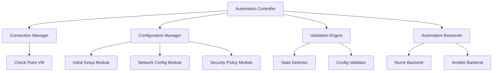
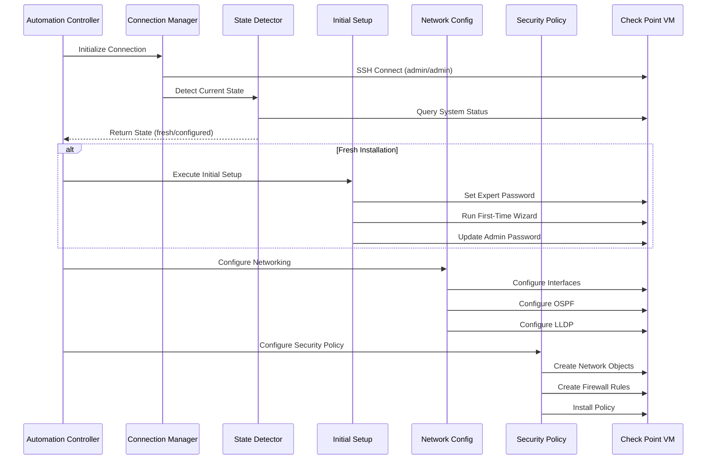

# Check Point VM Automation Design Document

## Overview

This design document outlines the architecture for automating Check Point VM configuration from initial setup through ongoing management. The solution addresses the unique challenges of Check Point's CLI behavior, authentication flow, and configuration management across different operational phases.

The system is designed with a modular approach that supports both Nornir and Ansible automation frameworks, with custom handling for Check Point's specific requirements during initial setup and ongoing configuration management.

## Architecture

### High-Level Architecture



### Component Interaction Flow



## Components and Interfaces

### 1. Connection Manager

**Purpose:** Handles SSH connections and session management for Check Point VMs

**Key Features:**
- Automatic state detection (fresh vs configured)
- Session persistence and reconnection
- CLI mode switching (clish ↔ expert)
- Authentication handling

**Interface:**
```python
class CheckPointConnectionManager:
    def connect(self, host: str, username: str, password: str) -> Connection
    def detect_state(self) -> CheckPointState
    def switch_to_expert(self, expert_password: str) -> bool
    def execute_command(self, command: str, mode: str = 'clish') -> CommandResult
    def disconnect(self) -> None
```

### 2. Initial Setup Module

**Purpose:** Handles fresh Check Point VM initialization

**Key Features:**
- Expert password creation
- First-time wizard automation
- Admin password update
- Basic system configuration

**Interface:**
```python
class InitialSetupModule:
    def set_expert_password(self, password: str) -> bool
    def run_first_time_wizard(self, config: WizardConfig) -> bool
    def update_admin_password(self, new_password: str) -> bool
    def verify_initial_setup(self) -> SetupStatus
```

### 3. Network Configuration Module

**Purpose:** Manages network interface and routing configuration

**Key Features:**
- Interface IP configuration
- OSPF routing setup
- LLDP configuration
- Network validation

**Interface:**
```python
class NetworkConfigModule:
    def configure_interfaces(self, interfaces: List[InterfaceConfig]) -> bool
    def configure_ospf(self, ospf_config: OSPFConfig) -> bool
    def configure_lldp(self, lldp_config: LLDPConfig) -> bool
    def validate_network_config(self) -> NetworkStatus
```

### 4. Security Policy Module

**Purpose:** Manages Check Point security objects and rules

**Key Features:**
- Network object creation
- Firewall rule management
- Policy installation
- Configuration validation

**Interface:**
```python
class SecurityPolicyModule:
    def create_network_objects(self, objects: List[NetworkObject]) -> bool
    def create_firewall_rules(self, rules: List[FirewallRule]) -> bool
    def install_policy(self) -> bool
    def validate_policy(self) -> PolicyStatus
```

### 5. Automation Backends

**Purpose:** Provide pluggable automation framework support

**Nornir Backend:**
- Custom tasks for Check Point operations
- Inventory management
- Result aggregation

**Ansible Backend:**
- Custom modules for Check Point CLI
- Playbook templates
- Integration with existing Check Point modules

## Data Models

### Configuration Models

```python
@dataclass
class CheckPointConfig:
    hostname: str
    management_ip: str
    expert_password: str
    admin_password: str
    interfaces: List[InterfaceConfig]
    ospf_config: OSPFConfig
    lldp_config: LLDPConfig
    network_objects: List[NetworkObject]
    firewall_rules: List[FirewallRule]

@dataclass
class InterfaceConfig:
    name: str
    ip_address: str
    subnet_mask: str
    description: Optional[str] = None

@dataclass
class OSPFConfig:
    router_id: str
    areas: List[OSPFArea]
    networks: List[OSPFNetwork]

@dataclass
class NetworkObject:
    name: str
    type: str  # host, network, range
    value: str
    description: Optional[str] = None

@dataclass
class FirewallRule:
    name: str
    source: List[str]
    destination: List[str]
    service: List[str]
    action: str  # accept, drop, reject
    track: str = "Log"
```

### State Models

```python
class CheckPointState(Enum):
    FRESH_INSTALL = "fresh"
    EXPERT_PASSWORD_SET = "expert_set"
    WIZARD_COMPLETE = "wizard_complete"
    FULLY_CONFIGURED = "configured"

@dataclass
class SystemStatus:
    state: CheckPointState
    version: str
    hostname: str
    interfaces_configured: bool
    policy_installed: bool
    last_config_change: datetime
```

## Error Handling

### Error Categories

1. **Connection Errors**
   - SSH connection failures
   - Authentication failures
   - Session timeouts

2. **Configuration Errors**
   - Invalid command syntax
   - Configuration conflicts
   - Resource limitations

3. **State Errors**
   - Unexpected system state
   - Incomplete configurations
   - Validation failures

### Error Handling Strategy

```python
class CheckPointError(Exception):
    """Base exception for Check Point operations"""
    pass

class ConnectionError(CheckPointError):
    """SSH connection related errors"""
    pass

class ConfigurationError(CheckPointError):
    """Configuration command errors"""
    pass

class ValidationError(CheckPointError):
    """Configuration validation errors"""
    pass

# Retry mechanism with exponential backoff
@retry(
    stop=stop_after_attempt(3),
    wait=wait_exponential(multiplier=1, min=4, max=10),
    retry=retry_if_exception_type(ConnectionError)
)
def execute_with_retry(command: str) -> CommandResult:
    # Implementation
    pass
```

## Testing Strategy

### Unit Testing

- Mock SSH connections for isolated testing
- Test each module independently
- Validate configuration parsing and generation
- Test error handling scenarios

### Integration Testing

- Test against Check Point VM instances
- Validate end-to-end workflows
- Test state transitions
- Verify idempotency

### Test Environment Setup

```python
class CheckPointTestEnvironment:
    def setup_fresh_vm(self) -> CheckPointVM
    def setup_configured_vm(self) -> CheckPointVM
    def cleanup_vm(self, vm: CheckPointVM) -> None
    def validate_configuration(self, vm: CheckPointVM, expected: CheckPointConfig) -> bool
```

### Test Scenarios

1. **Fresh Installation Flow**
   - Connect to fresh VM
   - Set expert password
   - Complete wizard
   - Verify basic functionality

2. **Network Configuration**
   - Configure additional interfaces
   - Setup OSPF routing
   - Enable LLDP
   - Validate connectivity

3. **Security Policy**
   - Create network objects
   - Define firewall rules
   - Install policy
   - Verify rule enforcement

4. **Idempotency Testing**
   - Run automation multiple times
   - Verify no duplicate configurations
   - Validate state consistency

5. **Error Recovery**
   - Simulate connection failures
   - Test configuration rollback
   - Validate error reporting

### Performance Considerations

- Connection pooling for multiple operations
- Batch configuration commands where possible
- Asynchronous operations for parallel tasks
- Configuration caching to avoid redundant queries

### Security Considerations

- Secure credential management
- Encrypted communication channels
- Audit logging for all operations
- Role-based access control integration